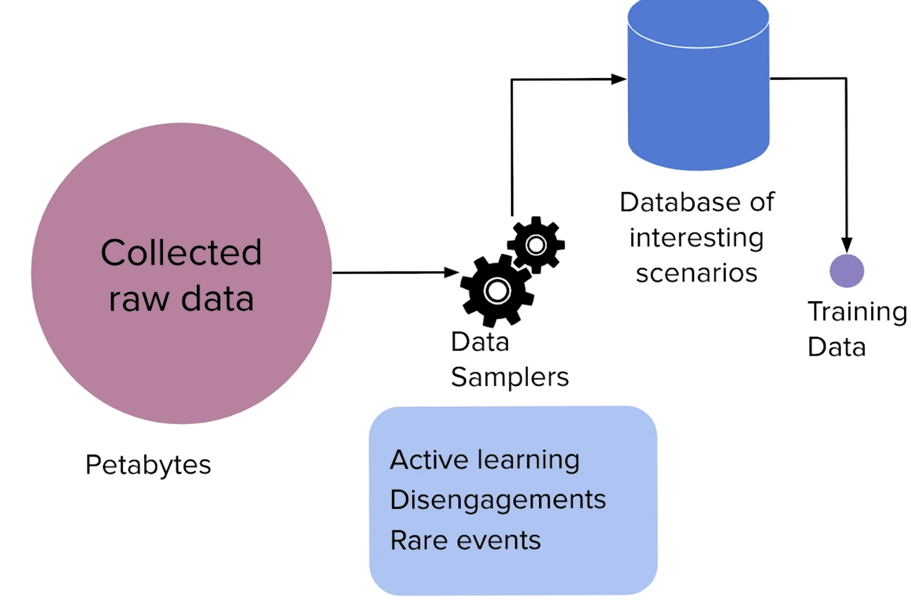
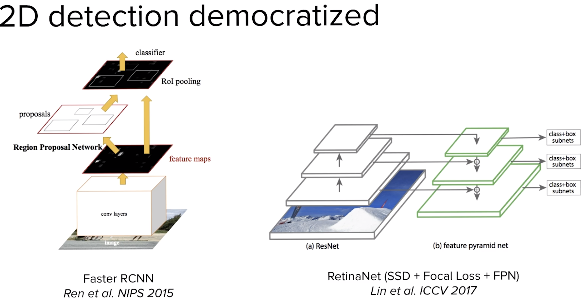
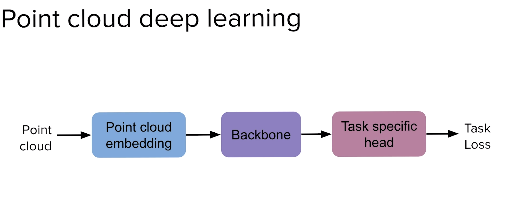
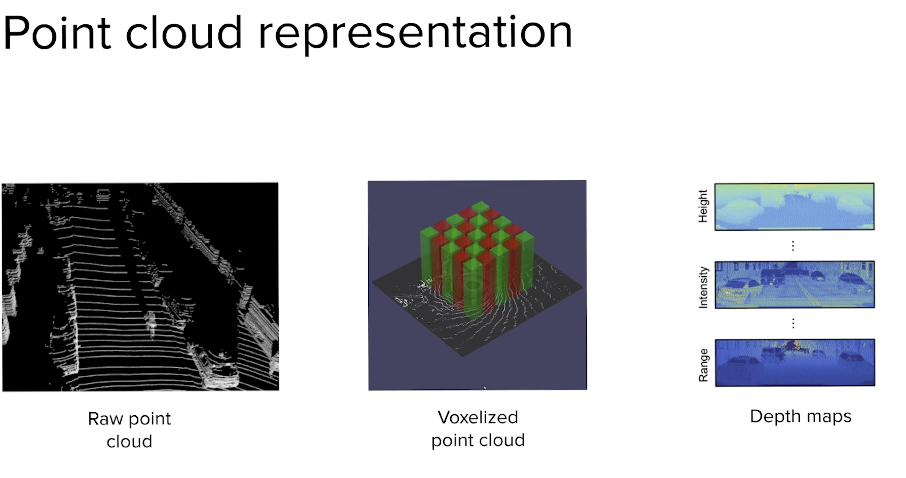
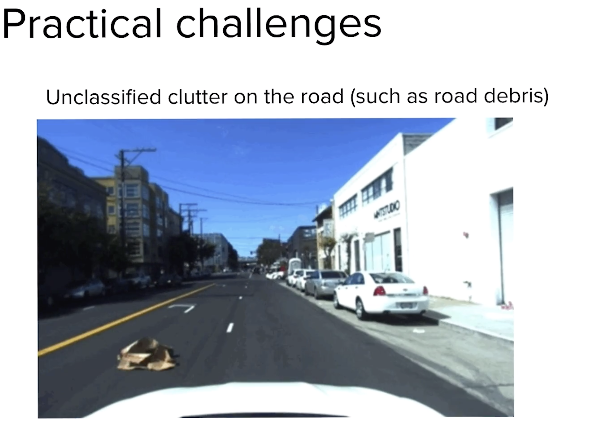
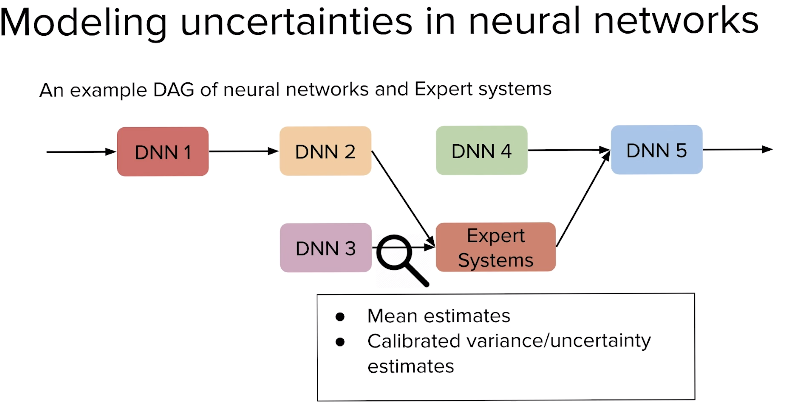
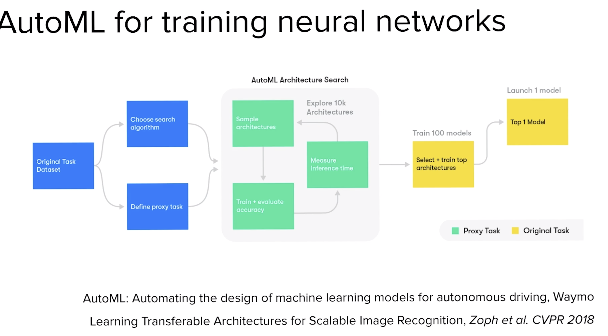

* 13 min video in https://medium.com/lyftlevel5/lyft-level-5-self-driving-dataset-competition-now-open-97493e9f154a

* LIDAR
  - detects smoke, dust etc. Things which don't hinder the car, but show up as obstacles
  - car at 100m away has very small point cloud; car 10m away has very clear point cloud. NN should be robust to take care of both cases

* Camera
  - Human labelled image data itself might have errors

* Image data and Lidar data must be aligned/Sensor fusion data must be time synchronized.

* Out of petabytes of collected data, only a fraction is useful. And this useful data needs to be hand labelled. Keeping in mind we don't bring in any class imbalances etc. For eg. Cars are way more frequent than say - birds

* Ability to query into the dataset is extremely helpful. "powerful data engineering pipelines"

Once you query, you can feed exactly that image/video into the model and check how it performs/retrain it on certain type of data

* Many traditional approaches have been replaced by DL in self driving pipeline.
* [2D object detection has been widely "democratized", and significant progress has been made (RCNN). This is in large part due to the recent widespread availability of labeled 2D-object annotations and the willingness of the research community to share models and code that deliver high performance. The same has not yet occurred in 3D object detection. Today, there are multiple competing technologies for 3D object detection. For instance some that use convolutions, versus some that don’t (e.g. Point Net), versus some that use continuous convolutions. Each of these approaches come with different tradeoffs resulting in no clear technology winner. This, in part, may be due to the lack of high-quality datasets in this domain](https://medium.com/lyftlevel5/lyft-level-5-self-driving-dataset-competition-now-open-97493e9f154a)
* 
* Point cloud DL is fairly unexplored till now
* 
* There isn't even consensus on whats the best point cloud representation
* 
* Combining point cloud with map can be interesting
* 
* Nice paper-
* 

* 
* When rain comes in, camera may not do well; and need to rely on LIDAR
* 
* When there is sudden clutter on road; camera may not capture it 100 meters in advance, having LIDAR helps here
* 
* In the below case, object occludes camera view, and region behind the object is unknown. Having camera data might help here

* It's common to have multiple NN working together; as a pipeline today. How to combine "uncertainties" of multiple NN is an open problem.

* Auto ML for self driving cars is interesting

